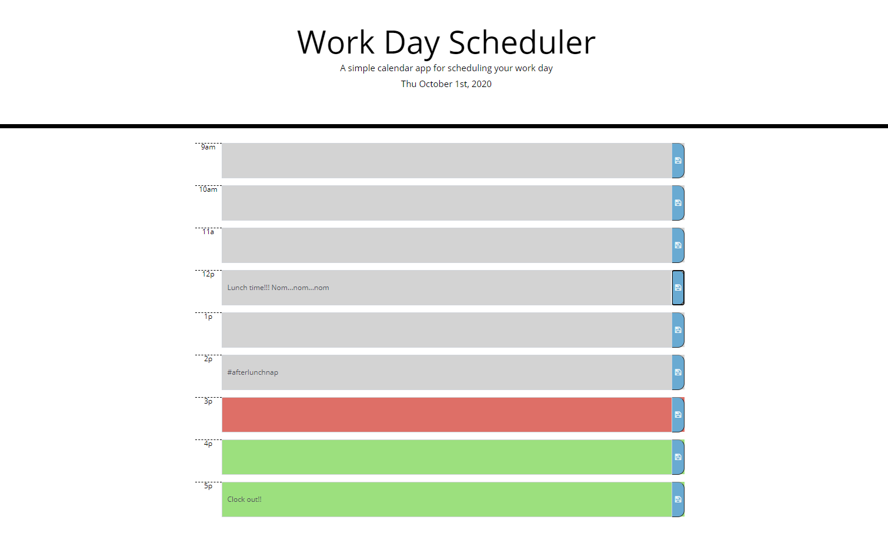

# DailyPlanner

## Description
* A daily planner that utilizes local storage to save appointments from day to day and color coding to signify past, present, and future plans.

## Compeleted Site

*Deployed Site https://aanderson120.github.io/DailyPlanner/

## Installation Instructions
* N/A

## Special Thanks
I collaborated with [Brooklynne Audette](https://github/B-Audette), [Dortea Flores-Kestner](https://github/dfkestner), and [Lindsey Bordner](https://LindseyM20). We were able to talk through the pseudocoding to simplify the code and were able to help each other debug when we came across issues.

## Liscense Information
* N/A